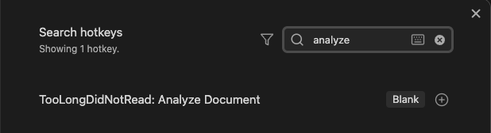

# Too Long Did Not Read

TLDR is a plugin for obsidian desktop integrating Google's Gemini LLM

# Usage

Make sure to create your own hotkey in order to use the `Analyze Document` Feature.

Once Set all you have to do is highlight the url you want to have gemini give a summary on and press your hotkey.